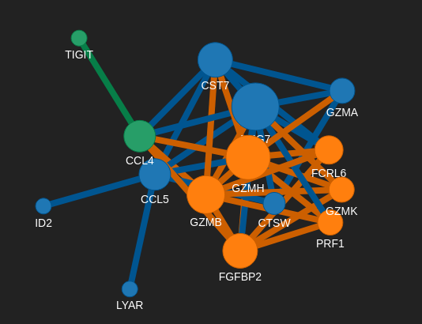
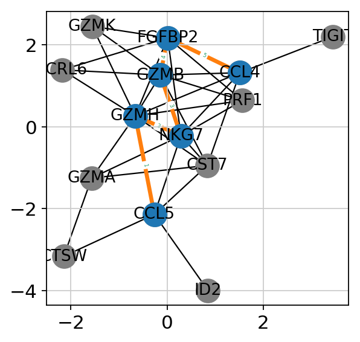
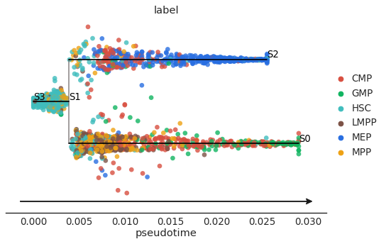
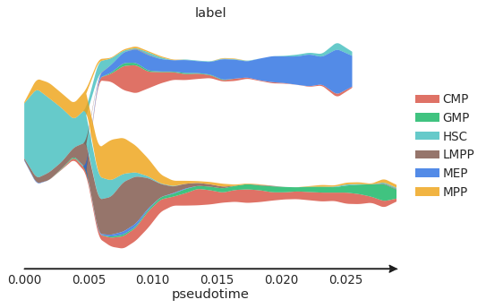
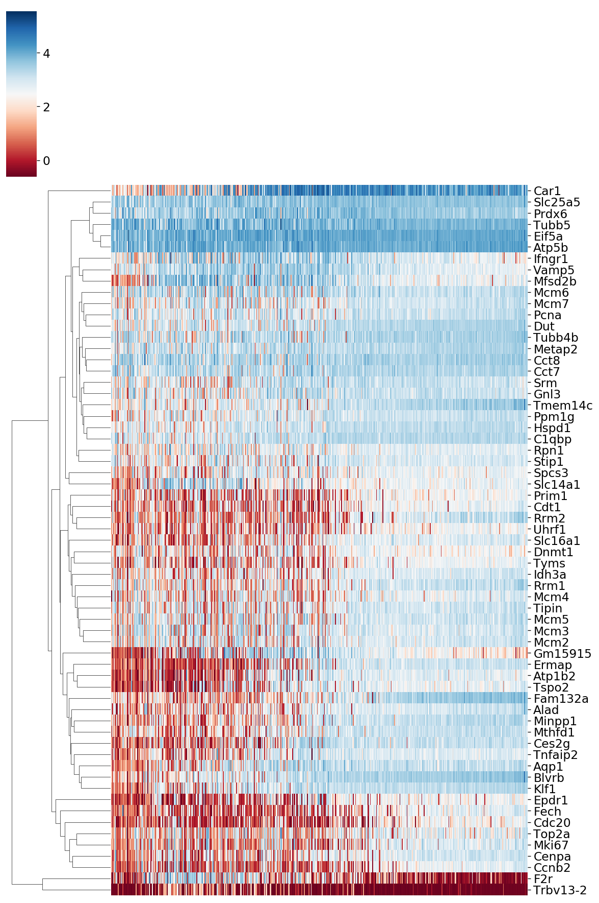
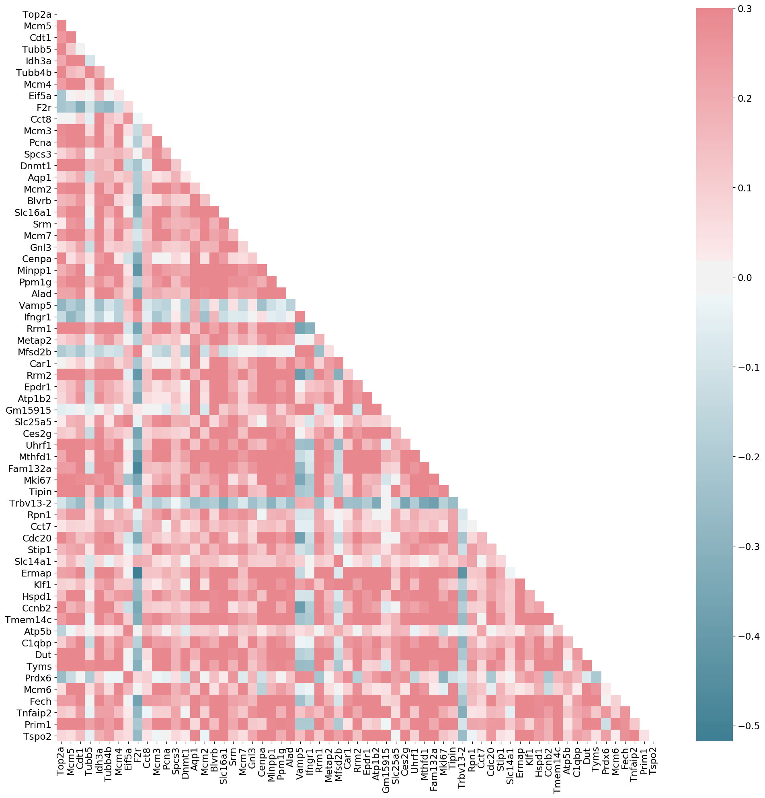

Tutorial
===============

pyscnet with scanpy
-------------------

As `scanpy`_ provides very great toolkits for single cell transcriptomics data analysis.
PySCNet can be considered as a downstream analysis tool especially for gene regulatory network analysis.
Besides identifying cell population, marker genes detection and cell trajectory analysis,
investigating the causal association among genes and transcription factors is also curial for understanding the molecular mechnisms behind.

So :tutorial: `pyscnet_scanpy`_ guides you how to build cell specific gene regulatory network applying various tools, predict consensus network and gene module detection as well as dynamic network visualization.

pyscnet with stream
----------------------

A python package - `STREAM`_ was designed for reconstructing cell trajectory for single cell transcriptomic data.
This :tutorial: `pyscnet_stream`_ guides how to integrate STREAM with pyscnet for gene regulatory network along the cell differential trajectory.

.. note::
    you might need to create stream environment and run jupyter-notebook under stream environment

.. _scanpy: https://scanpy.readthedocs.io/en/stable/index.html
.. _pyscnet_scanpy: https://github.com/MingBit/PySCNet/blob/master/tutorial/pyscnet_scanpy.ipynb

.. _STREAM: https://github.com/pinellolab/STREAM
.. _pyscnet_stream: https://github.com/MingBit/PySCNet/blob/master/tutorial/pyscnet_stream.ipynb